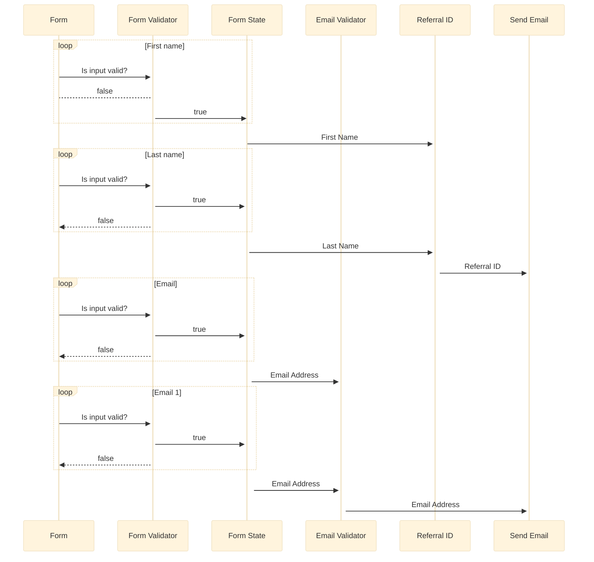
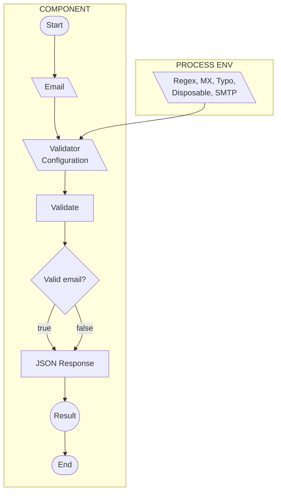
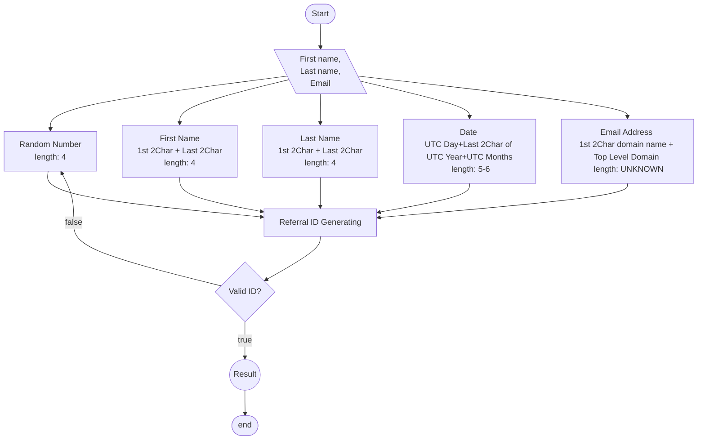
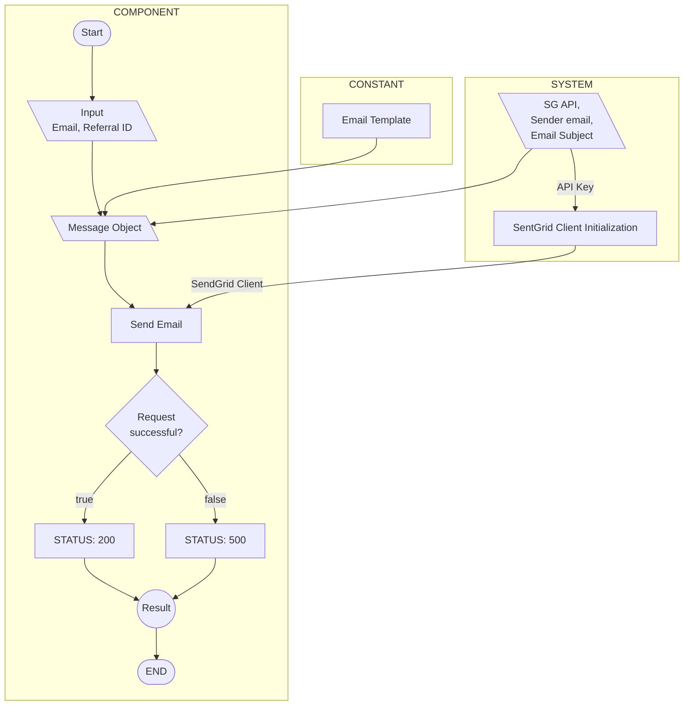

# EmailForm - HLD

|               |                         |
| ------------- | ----------------------- |
| Version No.   | 1.00                    |
| Project       | EmailForm               |
| Authorized by | Abu Taher Muhammad      |
| Date:         | 25/03/2022 - 28/03/2022 |

 
>> This report is submitted to CEO of Ferne Health in partial fulfillment of the requirement of the job interview task.
 
 

# Revision History

| Version | Date       | Author             | Reviewer           | Approver           | Comments      |
| ------- | ---------- | ------------------ | ------------------ | ------------------ | ------------- |
| 0.1     | 28/03/2022 |                    |                    |                    | Draft Version |
| 1.00    | 28/03/2022 | Abu Taher Muhammad | Abu Taher Muhammad | Abu Taher Muhammad | Draft Version |

# Table of Contents

1. [Introduction](#a-name"introduction"introductiona)
    - [Scope of the document](#a-name"scope-of-the-document"11-scope-of-the-documenta)
    - [Intended Audience](#a-name"intended-audience"intended-audiencea)
    - [System Overview](#a-name"system-overview"system-overviewa)
2. [System Design](#2-a-name"system-design"system-designa)
    - [Application Design](#a-name"application-design"application-designa)
        - [Process Flow](#a-name"process-flow-chart"process-flow-charta)
        - [Information Flow](#a-name"information-flow"information-flowa)
    - [Components Design](#a-name"component-design"-component-design-a)
    - [Key Design Considerations](#a-name"key-design-considerations"-key-design-considerations-a)
    - [API Catalogue](#a-name"api-catalogue"-api-catalogue-a)
3. [Non Functional Requirements](#3-a-name"non-functional-requirements"non-functional-requirements-a)
    - [Security Aspects](#a-name"security-aspects"-security-aspects-a)
    - [Performance Aspects](#a-name"performance-aspects"performance-aspects-a)
4. [References](#a-name"sequence-diagram"-sequence-diagram-a)

# <a name="introduction">Introduction</a>

## <a name="scope-of-the-document">1.1 Scope of the document</a>

This document outlines the high level functional design of referral ID generating functionality. It highlights the high level flows in referral id generating process, design of component, along with the rational for the same. It serves as an input to the low level design documents that would further elaborate on the application design.

## <a name="intended-audience">Intended Audience</a>

-   HR Team
-   Judge Team

## <a name="system-overview">System Overview</a>

This system provides a web interface to the referral ID generator component for filling up registration form and submits his registration request. This system also provides facility to validate & send email through API to make the whole system reusable afterwords. In referral ID generating process, users need to complete registration form having mandatory fields. This system will do the both soft level form validation and deep label email validation.
controller functions to generate unique referral ID and

# 2. <a name="system-design">System Design</a>

## <a name="application-design">Application Design:</a>

### <a name="process-flow-chart">Process Flow Chart</a>

If we take referral IF generator work flow as a sample, workflow diagram will be as shown in diagram

### <a name="sequence-diagram"> Sequence Diagram: </a>

<!-- %%{init: {'securityLevel': 'loose', 'theme':'base'}}%% -->

## <a name="component-design"> Component Design: </a>

### <a name="key-design-considerations"> Key Design Considerations </a>

-   Generate Referral ID component has been implemented as separate service
-   Send email, email validation side effect functional components are implemented as separate service(As API) apart from the main component, these can be invoked by other applications as well through API endpoint.

### **Component: Email Validator**

**Process Flow**
If we take email validator's work flow as a sample, workflow diagram will be as shown in diagram

### **Component: ID Generator**

**Process Flow**
If we take ID Generator's work flow as a sample, workflow diagram will be as shown in diagram

### **Component: Email Sender**

**Process Flow**
If we take email sender's work flow as a sample, workflow diagram will be as shown in diagram

### <a name="api-catalogue"> API Catalogue: </a>

| Sr. No. | Name Of API | Description                          | Input              | Output  | Access Level |
| ------- | ----------- | ------------------------------------ | ------------------ | ------- | ------------ |
| 1       | checkEmail  | This API validate a given email.     | Email              | ------  | Public       |
| 2       | sendEmail   | This API send email to a given email | email, Referral ID | 200/500 | Public       |

# 3. <a name="non-functional-requirements">Non Functional Requirements: </a>

## <a name="security-aspects"> Security Aspects </a>

Apart form infra level security here are some sample application level security considerations

-   Soft level email form data validation.
-   Deep level email data validation.

## <a name="performance-aspects">Performance Aspects </a>

[This section will capture the performance aspects of the application in scope]

# <a name="appendices"> Appendices: </a>

# <a name="information-flow">Information Flow </a>
